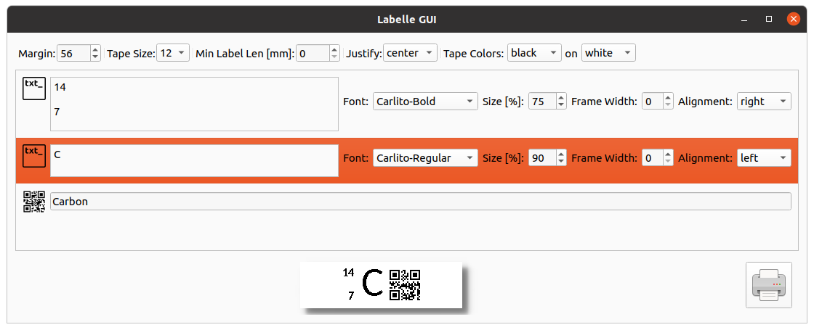
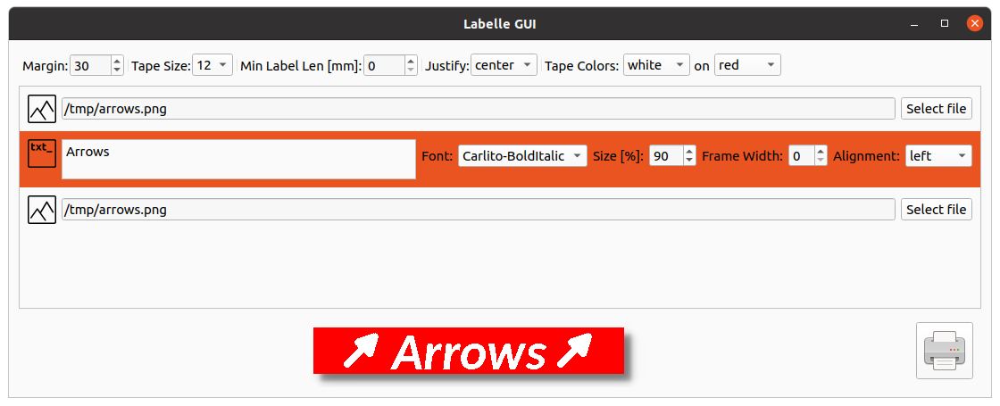
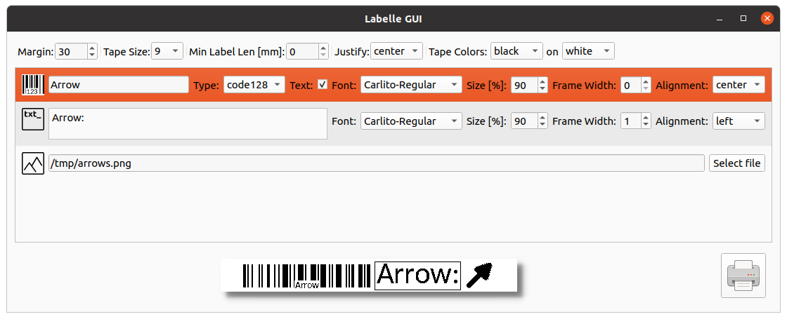

# Labelle

[](https://github.com/labelle-org/labelle)
[](https://pypi.org/project/labelle/)

<p align="center">
  </img><br>
</p>

## Open-source label printing software

* First version from Sebastian Bronner: <https://sbronner.com/dymoprint.html>
* Cloned to Github and formerly maintained by @computerlyrik and @maresb: <https://github.com/computerlyrik/dymoprint>
* Migrated to <https://github.com/labelle-org/labelle> and maintained by @tomers, @maresb, and @tomek-szczesny

## Features

* Text printing
* QR code printing
* Barcode printing
* Image printing
* Combinations of the above
* GUI Application based on PyQt6
* Windows support by setting the driver to WinUSB using [Zadig](https://zadig.akeo.ie/)

### Supported devices

* DYMO LabelManager PC
* DYMO LabelPoint 350
* DYMO LabelManager 280
* DYMO LabelManager 420P
* DYMO LabelManager Wireless PnP

Labelle is not affiliated with DYMO. Please see the [disclaimer](#disclaimers) below.

For more information about experimental device support, see [#44](https://github.com/computerlyrik/dymoprint/issues/44).

## Installation

It is recommended to install Labelle with [pipx](https://pypa.github.io/pipx/) so that it runs in an isolated virtual environment:

```bash
pipx install labelle
```

In case pipx is not already installed, it can be installed on Ubuntu/Debian with

```bash
sudo apt-get install pipx
```

or on Arch with

```bash
sudo pacman -S python-pipx
```

By default, users don't have permission to access generic USB devices, so you will
need to add a rule. The first time you run `labelle`, it will give instructions
about how to do this:

```bash
$ labelle "Hello world"
...
You do not have sufficient access to the device. You probably want to add the a udev rule in /etc/udev/rules.d with the following command:

  echo 'ACTION=="add", SUBSYSTEMS=="usb", ATTRS{idVendor}=="0922", ATTRS{idProduct}=="1001", MODE="0666"' | sudo tee /etc/udev/rules.d/91-labelle-1001.rules
...
```

## Testing experimental features

To install a test branch, by GitHub user `ghuser` for the branch `branchname`, run

```bash
pipx install --force git+https://github.com/ghuser/labelle@branchname
```

To revert back to the release version, run

```bash
pipx install --force labelle
```

To install a particular release version, specify `labelle==x.y.z` in place of `labelle` in the above command.

## Development

To install for development, fork and clone this repository, and run (ideally within a venv):

```bash
pip install --editable .
```

This project uses [pre-commit](https://pre-commit.com/) to run some checks before committing.
After installing the `pre-commit` executable, please run

```bash
pre-commit install
```

## Font management

Fonts are managed via [labelle.ini](labelle.ini). This should be placed in your
config folder (normally `~/.config`). An example file is provided here.

You may choose any TTF Font you like

You may edit the file to point to your favorite font.

For my Arch-Linux System, fonts are located at e.g.

```bash
/usr/share/fonts/TTF/DejaVuSerif.ttf
```

It is also possible to Download a font from
<http://font.ubuntu.com/> and use it.

## Modes

### Print text

```labelle MyText```

Multilines will be generated on whitespace

```labelle MyLine MySecondLine # Will print two Lines```

If you want whitespaces just enclose in " "

```labelle "prints a single line"```

### Print QRCodes and Barcodes

```labelle --help```

### Print Codes and Text

Just add a text after your qr or barcode text

```labelle -qr "QR Content" "Cleartext printed"```

### Picture printing

Any picture with JPEG standard may be printed. Beware it will be downsized to tape.

```labelle -p mypic.jpg ""```

Take care of the trailing "" - you may enter text here which gets printed in front of the image

## GUI

### Run Labelle GUI

```labelle-gui```

#### GUI Features

* Live preview
* margin settings
* type size selector
* visualization of tape color schema
* the ability to freely arrange the content using the "Node" list
  * Text Node:
    * payload text - can be multi-line
    * font selector
    * font scaling - the percentage of line-height
    * frame border width steering
  * Qr Node:
    * payload text
  * BarCode Node:
    * payload text
    * codding selector
  * Image Node:
    * path to file

Nodes can be freely arranged, simply drag&drop rows on the list.
To add or delete the node from the label - right-click on the list and select the action from the context menu.
To print - click the print button.

### Example

Example 1: multiple text + QR code



Example 2: two images + text with frame, white on red



Example 3: barcode with text, text, image



## About the name

The name "Labelle" is a multilingual pun by [@claui](https://github.com/computerlyrik/dymoprint/issues/114#issuecomment-1978982019).

| Language | Word/Interpretation   | Meaning           | Pronunciation (IPA) | Simplified Phonetic Spelling |
|----------|-----------------------|-------------------|---------------------|------------------------------|
| English  | Label                 | A printed sticker | /ˈleɪbəl/           | LAY-buhl                     |
| French   | La belle              | The beautiful     | /la bɛl/            | lah BEL                      |
| German   | Libelle (sounds like) | Dragonfly         | /liˈbɛlə/           | lee-BELL-uh                  |

## Disclaimers

* This software is provided as-is, without any warranty. Please see [LICENSE](LICENSE) for details.
* Labelle is not affiliated, associated, authorized, endorsed by, or in any way
  officially connected with DYMO Corporation, or any of its subsidiaries or its
  affiliates. The official DYMO website can be found at <www.dymo.com>. The name DYMO®,
  as well as related names, marks, emblems, and images, are registered trademarks of
  their respective owners. Currently, Labelle software is designed to support certain
  devices manufactured by DYMO; however, no endorsement or partnership is implied.
