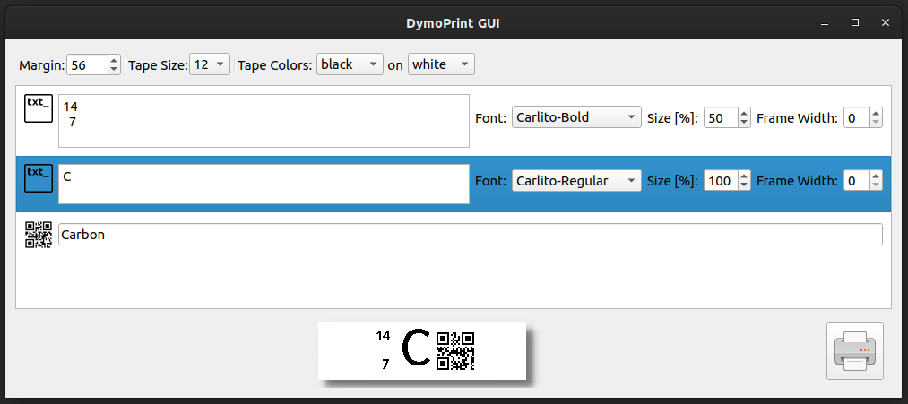
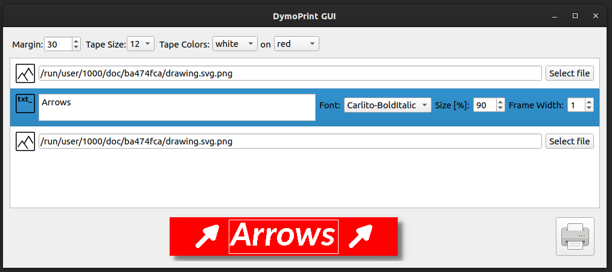
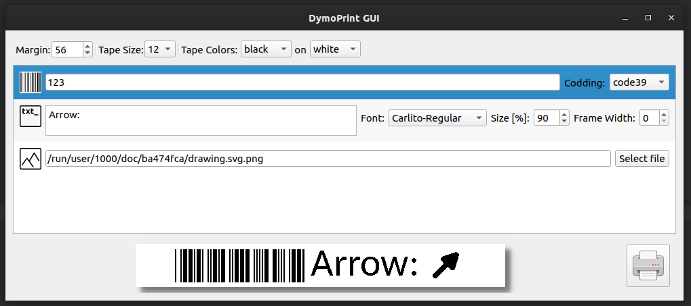

# dymoprint

[](https://github.com/computerlyrik/dymoprint)
[](https://pypi.org/project/dymoprint/)

Linux Software to print with LabelManager PnP from Dymo

* First version from Sebastian Bronner: <https://sbronner.com/dymoprint.html>
* Cloned to Github and formerly maintained by @computerlyrik: <https://github.com/computerlyrik/dymoprint>
* Currently maintained by @maresb

## Features

* Text printing
* QR code printing
* Barcode printing
* Image printing
* Combinations of the above
* GUI Application based on PyQt6

### Experimental

* LabelManager PC
* LabelPoint 350
* LabelManager 280
* LabelManager 420P
* LabelManager Wireless PnP
* Windows support by setting the driver to WinUSB using [Zadig](https://zadig.akeo.ie/)

For more information about experimental device support, see [#44](https://github.com/computerlyrik/dymoprint/issues/44).

## Installation

It is recommended to install dymoprint with [pipx](https://pypa.github.io/pipx/) so that it runs in an isolated virtual environment:

```bash
pipx install dymoprint
```

In case pipx is not already installed, it can be installed on Ubuntu/Debian with

```bash
sudo apt-get install pipx
```

or on Arch with

```bash
sudo pacman -S python-pipx
```

By default, users don't have permission to access generic USB devices, so you will
need to add a rule. The first time you run `dymoprint`, it will give instructions
about how to do this:

```bash
$ dymoprint "Hello world"
...
You do not have sufficient access to the device. You probably want to add the a udev rule in /etc/udev/rules.d with the following command:

  echo 'ACTION=="add", SUBSYSTEMS=="usb", ATTRS{idVendor}=="0922", ATTRS{idProduct}=="1001", MODE="0666"' | sudo tee /etc/udev/rules.d/91-dymo-1001.rules
...
```

## Testing experimental features

To install a test branch, by user `ghuser` for the branch `branchname`, run

```bash
pipx install --force git+https://github.com/ghuser/dymoprint@branchname
```

To revert back to the release version, run

```bash
pipx install --force dymoprint
```

To install a particular release version, specify `dymoprint==x.y.z` instead of `dymoprint` in the above command.

## Development and code style

To install for development, fork and clone this repository, and run (ideally within a venv):

```bash
pip install --editable .
```

This project uses [pre-commit](https://pre-commit.com/) to run some checks before committing.
After installing the `pre-commit` executable, please run

```bash
pre-commit install
```

## Font management

Fonts are managed via [dymoprint.ini](dymoprint.ini). This should be placed in your
config folder (normally `~/.config`). An example file is provided here.

You may choose any TTF Font you like

You may edit the file to point to your favorite font.

For my Arch-Linux System, fonts are located at e.g.

```bash
/usr/share/fonts/TTF/DejaVuSerif.ttf
```

It is also possible to Download a font from
<http://font.ubuntu.com/> and use it.

For font discovery, Dymoprint contains code excerpts from
[`matplotlib`](https://github.com/matplotlib/matplotlib/).
See [here](vendoring/README.md) for more information and
[LICENSE](src/dymoprint/_vendor/matplotlib/LICENSE) for the license.

## Modes

### Print text

```dymoprint MyText```

Multilines will be generated on whitespace

```dymoprint MyLine MySecondLine # Will print two Lines```

If you want whitespaces just enclose in " "

```dymoprint "prints a single line"```

### Print QRCodes and Barcodes

```dymoprint --help```

### Print Codes and Text

Just add a text after your qr or barcode text

```dymoprint -qr "QR Content" "Cleartext printed"```

### Picture printing

Any picture with JPEG standard may be printed. Beware it will be downsized to tape.

```dymoprint -p mypic.jpg ""```

Take care of the trailing "" - you may enter text here which gets printed in front of the image

## GUI

### Run DymoPrint GUI

```dymoprint_gui```


### Features
* Live preview
* margin settings
* type size selector
* visualization of tape color schema
* the ability to freely arrange the content using the "Node" list
  * Text Node:
    * payload text - can be multi-line
    * font selector
    * font scaling - the percentage of line-height
    * frame border width steering
  * Qr Node:
    * payload text
  * BarCode Node:
    * payload text
    * codding selector
  * Image Node:
    * path to file

Nodes can be freely arranged, simply drag&drop rows on the list.
To add or delete the node from the label - right-click on the list and select the action from the context menu.
To print - click the print button.

### Example

Example 1: multiple text + QR code



Example 2: two images + text with frame, white on red



Example 3: barcode, text, image




## Development

Besides the travis-ci one should run the following command on a feature implemention or change to ensure the same outcome on a real device:

```bash
dymoprint Tst && \
dymoprint -qr Tst && \
dymoprint -c code128 Tst && \
dymoprint -qr qrencoded "qr_txt" && \
dymoprint -c code128 Test "bc_txt"
```

### ToDo

* ~~(?)support multiple ProductIDs (1001, 1002) -> use usb-modeswitch?~~
* ~~put everything in classes that would need to be used by a GUI~~
* ~~for more options use command line parser framework~~
* ~~allow selection of font with command line options~~
* ~~allow font size specification with command line option (points, pixels?)~~
* ~~provide an option to show a preview of what the label will look like~~
* ~~read and write a .dymoprint file containing user preferences~~
* ~~print barcodes~~
* ~~print graphics~~
* ~~plot frame around label~~
* vertical print
* refactor code with better abstractions
* pixel fonts
* web interface
